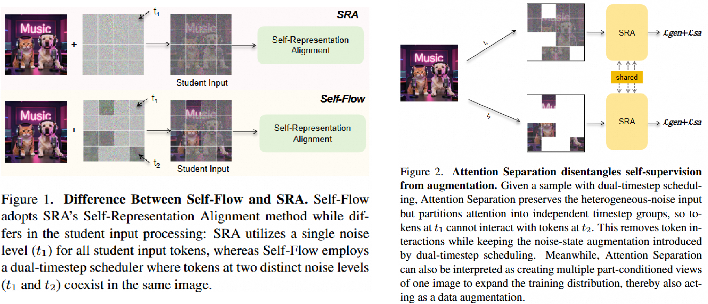

<h1 align="center">From SRA to Self-Flow: Data Augmentation or Self-Supervision?</h1>

<div align="center">

<a href="https://arxiv.org/abs/" target="_blank"></a>

</div>


<p align="center">
  
</p>


## 🏡 Environment Setup

```bash
conda create -n sra python=3.12 -y
conda activate sra
pip install -r requirements.txt
```

## Dataset Preparation

See [Here](https://github.com/vvvvvjdy/SRA/tree/main/preprocessing) for detailed guidance.


## 🔥 Training

```bash
bash scripts/train.sh
```

Before running, edit these values in `scripts/train.sh`:

- `DATA_DIR`: path to the preprocessed ImageNet latent features.
- `OUTPUT_DIR`: base directory for experiments.
- `EXP_NAME`: experiment name under `OUTPUT_DIR`.
- `NUM_PROCS`: number of GPUs used by Accelerate.

The script creates:

```text
OUTPUT_DIR/EXP_NAME/
  args.json
  log.txt
  loss_log/loss_gen_log.jsonl
  samples/
  checkpoints/
```

Important training options:
- `--batch-size`: total batch size across all GPUs. (default: 256)
- `--mask-ratio`: mask ratio for token groups. A single value like `0.25` creates two groups `[0.25, 0.75]`. (default: 0.25)
- `--dual-time-scheduling`: wthether to use dual-time scheduling for the two token groups. (default: True)
- `--attention-separation`: separates attention between token groups. (default: True)
- `--full-sample-prob`: probability of replacing a two-group mixed sample with a full-image sample in a batch. (default: 0.0)
- `--teacher-t`: timestep strategy for the teacher. Supported values are `self_flow`, `same`, and `sra`. (default: `sra`)
- `--teacher-mask`: applies the mixed-token mask to the teacher branch. (default: True)
- `--use-alignment-loss`: enables the self-representation alignment loss. (default: True)

## 🌠 Evaluation

Generate png samples and convert them to `.npz`:

```bash
bash scripts/gen.sh
```

Before running, edit these values in `scripts/gen.sh`:

- `CKPT`: checkpoint path.
- `SAMPLE_ROOT`: output directory for png samples and `samples.npz`.
- `NUM_GPUS`: number of GPUs for sampling.

The resulting `.npz` file can be evaluated with the [ADM evaluation](https://github.com/openai/guided-diffusion/tree/main/evaluations) suite.


## 📣 Notes

It's possible that this code may not accurately replicate the results outlined in the paper due to potential human errors during the preparation and cleaning of the code for release as well as the difference of the hardware facility. If you encounter any difficulties in reproducing our findings, please don't hesitate to inform us. 

## 🤝🏻 Acknowledgement

This code is built on [SRA](https://github.com/vvvvvjdy/SRA). Thanks to the authors for their solid open-source work.

## 🌺 Citation

```bibtex
@article{sra_dts_as_2026,
  title={From SRA to Self-Flow: Data Augmentation or Self-Supervision?},
  author={},
  journal={arXiv preprint arXiv:},
  year={2026}
}
```
